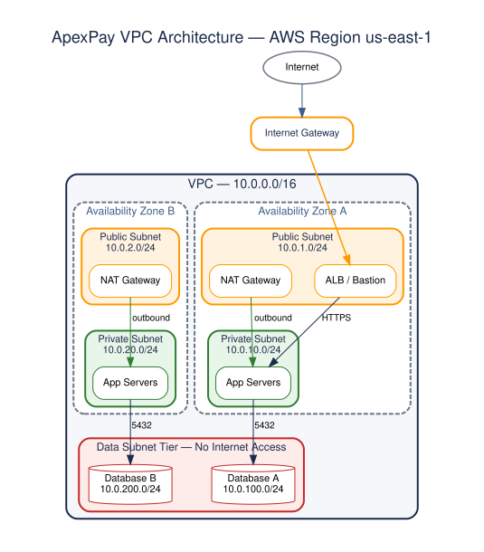
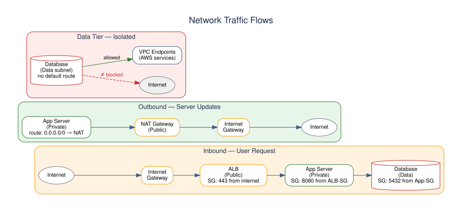
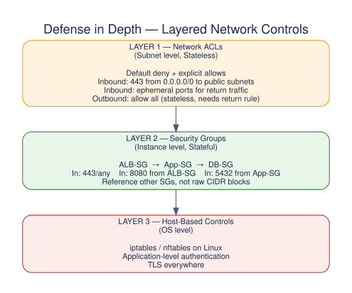
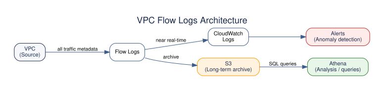
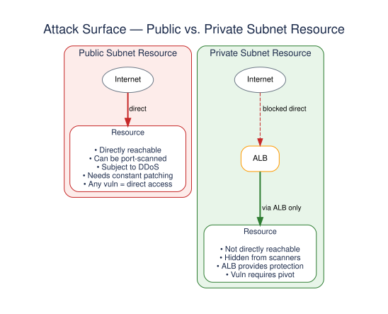
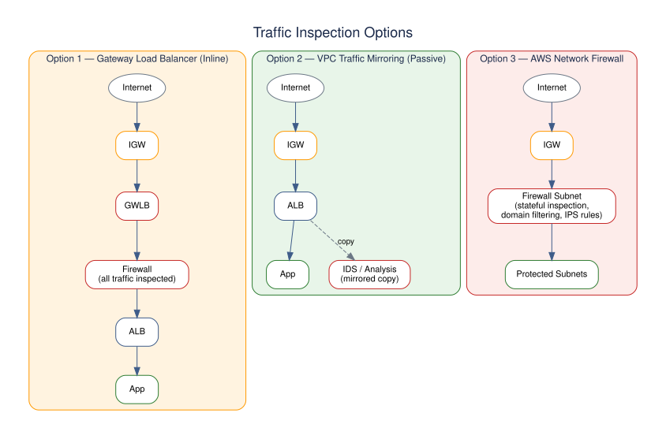

<div align="center">

# 🌐 VPC Infrastructure-as-Code & Network Security Controls

**Security Architecture · Network Segmentation · Perimeter Governance**


*A fictional GRC case study simulating network segmentation governance for a cloud payment processor.*

</div>

---

## 📌 At a Glance

| | |
|---|---|
| **GRC Domain** | Security Architecture, Network Segmentation, Perimeter Governance |
| **Role Simulated** | Cloud Security Architect / Infrastructure Engineer |
| **Frameworks Mapped** | PCI-DSS v4.0 Req 1.2/1.3 · CIS AWS Benchmark 5.x · NIST SP 800-53 AC-4 |
| **Scenario** | *Apex Cloud Financial Systems (ApexPay)* — Network Segmentation Governance |
| **Project Type** | Fictional Portfolio Case Study |

### 📂 Key Deliverables

| Deliverable | Description | Link |
|---|---|---|
| 🏗️ VPC Architecture (Terraform) | Full IaC implementation | [`terraform/main.tf`](./terraform/main.tf) |
| 📋 Network Micro-segmentation Standard | Governance policy document | [`docs/network_security_policy.md`](./docs/network_security_policy.md) |

---

## 🎯 Overview

Infrastructure as Code is no longer optional — a cloud security project built by clicking around the console already looks outdated. This project designs and implements a **production-grade VPC in Terraform**, treating security as a first-class architectural concern rather than an afterthought bolted on post-deployment.

---

## 🏗️ Architecture Diagram

<p align="center">
  
</p>

Three-tier subnet design spread across two Availability Zones for high availability, with a fully internet-isolated data tier for anything holding sensitive payment data.

---

## 🔀 Traffic Flow

<p align="center">
  
</p>

| Flow | Path | Governing Control |
|---|---|---|
| **Inbound** | Internet → IGW → ALB (public) → App (private) → DB (data) | Security groups scoped hop-by-hop — each tier only accepts traffic from the SG in front of it |
| **Outbound** | App (private) → NAT Gateway (public) → IGW → Internet | Route table: `0.0.0.0/0 → NAT`, never a direct path |
| **Data tier** | Isolated — no default internet route | AWS service access only via VPC Endpoints |

---

## 🧱 Defense in Depth

<p align="center">
  
</p>

Three independent, stacked layers — a misconfiguration in one layer doesn't collapse the whole perimeter:

1. **Network ACLs** — subnet-level, stateless, default-deny with explicit allows
2. **Security Groups** — instance-level, stateful, reference other SGs instead of raw CIDRs
3. **Host-based controls** — OS firewall, app-level auth, TLS everywhere

---

## 🧩 Subnet Design

| Subnet Type | CIDR Range | Internet Access | Purpose |
|---|---|---|---|
| Public A | `10.0.1.0/24` | Direct (IGW) | ALB, NAT Gateway, Bastion |
| Public B | `10.0.2.0/24` | Direct (IGW) | ALB, NAT Gateway (HA) |
| Private A | `10.0.10.0/24` | Outbound only (NAT) | Application servers |
| Private B | `10.0.20.0/24` | Outbound only (NAT) | Application servers |
| Data A | `10.0.100.0/24` | None | Databases, sensitive data |
| Data B | `10.0.200.0/24` | None | Databases, sensitive data |

### Route Tables

| | Destination | Target |
|---|---|---|
| **Public RT** | `10.0.0.0/16` → local · `0.0.0.0/0` → `igw-xxx` | Full internet access |
| **Private RT** | `10.0.0.0/16` → local · `0.0.0.0/0` → `nat-xxx` | Outbound-only (updates, external APIs) |
| **Data RT** | `10.0.0.0/16` → local · *(no default route)* | No internet path — VPC Endpoints only |

---

## ⚖️ Security Groups vs. Network ACLs

| | Security Groups | Network ACLs |
|---|---|---|
| **Scope** | Instance / ENI level | Subnet level |
| **State** | Stateful (return traffic auto-allowed) | Stateless (explicit return rules needed) |
| **Rule types** | Allow only | Allow **and** deny |
| **Evaluation** | All rules evaluated together | Evaluated in rule-number order |
| **References** | Can reference other SGs | CIDR blocks only |
| **Best for** | Fine-grained app access, dynamic references, most day-to-day control | Subnet-wide blocks, explicit denies, compliance requirements, emergency blocks |

---

## 📊 VPC Flow Logs Architecture

<p align="center">
  
</p>

Every packet's metadata is captured, routed to CloudWatch for near-real-time anomaly alerting, and archived to S3 for long-term, Athena-queryable audit history.

```
Log format:
<version> <account-id> <interface-id> <srcaddr> <dstaddr>
<srcport> <dstport> <protocol> <packets> <bytes> <start>
<end> <action> <log-status>
```

---

## 🎯 Why Private Subnets? — Attack Surface Comparison

<p align="center">
  
</p>

Putting compute behind a load balancer instead of exposing it directly isn't just convention — it removes an entire class of exposure: port scanning, direct DDoS, and "any vulnerability = instant access" failure modes.

---

## 🔍 Where Would Inspection Live?

<p align="center">
  
</p>

| Option | Approach | Trade-off |
|---|---|---|
| **Gateway Load Balancer (inline)** | All traffic routed through a firewall before reaching the ALB | Strongest control, adds latency and a scaling dependency |
| **VPC Traffic Mirroring (passive)** | Traffic copied to an IDS/analysis pipeline, original path unaffected | Zero latency impact, but detection is after-the-fact, not preventive |
| **AWS Network Firewall** | Dedicated firewall subnet with stateful inspection, domain filtering, IPS rules | Managed service simplicity, still adds a hop and cost |

---

## 📁 Project Structure

```
02-vpc-infrastructure-as-code/
├── README.md
├── terraform/
│   ├── main.tf              # Provider and backend config
│   ├── vpc.tf               # VPC and subnets
│   ├── routing.tf           # Route tables and associations
│   ├── security_groups.tf   # Security group definitions
│   ├── nacls.tf             # Network ACL rules
│   ├── nat.tf               # NAT Gateway configuration
│   ├── endpoints.tf         # VPC Endpoints for AWS services
│   ├── flow_logs.tf         # VPC Flow Logs configuration
│   ├── variables.tf         # Input variables
│   ├── outputs.tf           # Output values
│   └── terraform.tfvars     # Variable values
└── docs/
    ├── architecture.md      # Detailed architecture explanation
    └── security-decisions.md # Why each decision was made
```

---

## ✅ Deliverables Checklist

- [x] Terraform code for complete VPC setup
- [x] Public, private, and data subnet tiers
- [x] NAT Gateway for private subnet outbound access
- [x] Security groups with least-privilege rules
- [x] Network ACLs for subnet-level controls
- [x] VPC Flow Logs to CloudWatch and S3
- [x] VPC Endpoints for common AWS services
- [x] Architecture diagram with data flows
- [x] Security decision documentation

---

## ❓ Questions Answered in This Documentation

1. Why are certain resources in private subnets?
2. What traffic is allowed in and out?
3. How do security groups and NACLs complement each other?
4. Where would inspection or logging live in a real environment?
5. How does this design reduce attack surface?
6. How does it support future growth?

---

## 🚫 Common Mistakes to Avoid

| Mistake | Fix |
|---|---|
| Opening `0.0.0.0/0` on security groups | Use specific CIDRs or SG references |
| Using `/16` subnets (wastes IP space) | Use `/24` for most subnets, plan for growth |
| Single-AZ deployment | Always deploy across at least 2 AZs |
| No VPC Flow Logs | Enable flow logs to CloudWatch **and** S3 |
| Database in a public subnet | Data tier should have **no** internet access |
| Hardcoded IPs in security groups | Use variables and SG references where possible |

---

## 📚 Further Reading

- [AWS VPC Best Practices](https://docs.aws.amazon.com/vpc/latest/userguide/vpc-security-best-practices.html)
- [Terraform AWS VPC Module](https://registry.terraform.io/modules/terraform-aws-modules/vpc/aws/latest)
- [AWS Network Firewall](https://docs.aws.amazon.com/network-firewall/latest/developerguide/what-is-aws-network-firewall.html)

---

<div align="center">

**Security teams spend enormous amounts of time reviewing architectures like this.** Demonstrating this level of thinking immediately elevates a portfolio above "I deployed a VPC."

</div>
